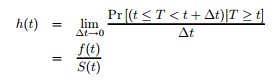
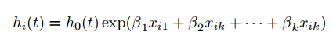
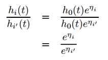
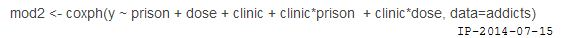

Cox回归分析是在生存分析中最常用的影响因素分析，回归模型的前提假设只有一个：分析的因素必须满足**比例风险假设**，即协变量不随时间的变化而变化。  

## Cox比例风险模型  

Cox回归模型建模的主要对象是危险率（Hazard Rate），记作$h(t)$，它的基本形式：  

  

它表示已生存到时间$t$的观察对象在t时刻的瞬时发生事件的概率，值为非负数。当$Δt=1$时，此时风险函数表示的就是时刻t存活的个体在此后一个单位死亡概率。  

Cox回归的假设是$h$满足这样的分布：  

   

其中$h_0(t)$我们不要去管它,，表示的是基线风险，即协变量为0时的风险率。对于两个对象，它们危险率的比值（Hazard Ratio）是和$h_0(t)$无关的。

  

**对于每一个因素，如果回归系数的检验检验p值小于给定阈值，那么它的回归系数如果为正，该因素为风险因素，否则为保护因素（不利因素）。当确定该因素确实影响生存之后，影响力的大小可以用HR（hazard ratio）来表示。HR表示该影响因素增加一个单位风险率相对于原来增加多少倍。**  

总结起来就是：  

+ P<0.05,β>0，HR>1(95%CI >1)，说明变量X增加时，危险率增加，即X是危险因素；  
+ P<0.05,β<0，HR<1(95%CI <1)，说明变量X增加时，危险率下降，即X是保护因素；  
+ P=0.05,β较大可能=0，HR较大可能=1，说明变量X增加时，危险率不变，即X是危险无关因素。  

## 比例风险的假设的检验  

该假设主要用于评估**协变量是否可以用于cox风险回归模型。但是，一般都不需要进行评估。**  

判断一个变量是否满足比例风险模型假设有以下三种方式：  

+ 如果协变量为类协变量（即category var），那么每组别的K-M生存曲线无交叉，则满足比例风险假设；  
+ 以生存时间t为横轴，对数对数生存率ln[-ln(p)]为纵轴，绘制分类变量的每一组别的生存曲线，如果各组别对应的曲线直观上平行，则满足风险比例条件。  
+ 对于连续型协变量，可将每个协变量与对数生存时间的交互项X*ln(t)放入回归模型中，如果该将互相项没有统计学意义，则满足风险比例假设，如：  

   

**当分析按比例风险的假定条件不成立是，可采用两种方法来解决**：  

+ 将这种不满足假定的协变量作为分层变量，然后再用其余变量进行多元Cox回归模型分析。（分层分析）  
+ 使用其他的参数模型。  

## 注意事项  

1. 年龄，作为连续变量，一般情况是默认服从比例风险假设的，可以直接进行回归分析。  
2. 单因素分析一方面可初步筛选出可能与预后有关的因素；另一方面去除那些根本不可能相关的因素，以减少建立多元回归模型时的“压力”。  

 