## R语言绘制基础图形  

R语言绘制图像主要有三种方式：（1）由`graphics`包提供的基础绘图方式；（2）基于`ggplot2`的`qplot()`快捷绘图函数；（3）`ggplot2`图层绘图风格  

### 散点图  

```R
## 方法一
plot(mtcars$wt, mtcars$mpg)

## 方法二
qplot(mtcars$wt, mtcars$mpg)

## 方法三
ggplot(mtcars, aes(x=wt, y=mpg)) + geom_point()
```

<div align="center">
  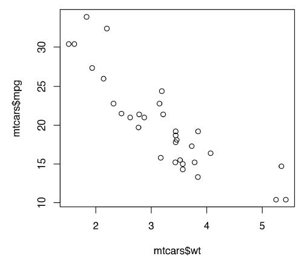
  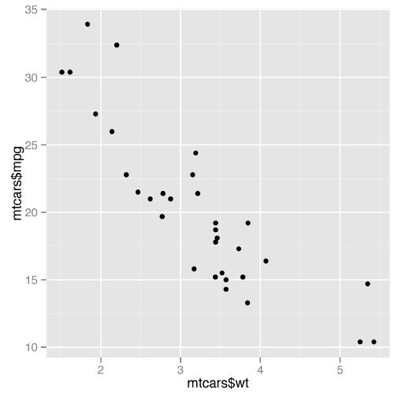    
</div>


### 线图  

```R
## 方法一
plot(pressure$temperature, pressure$pressure, type="l")

## 方法二
qplot(pressure$temperature, pressure$pressure, geom="line")

## 方法三
ggplot(pressure, aes(x=temperature, y=pressure)) + geom_line()
```

<div align="center">
  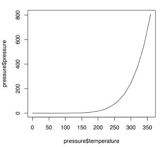
  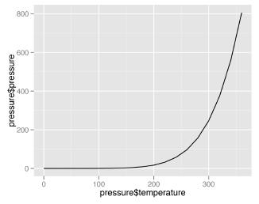    
</div>


同时绘制点和线  

```R
## 方法一
lines(pressure$temperature, pressure$pressure, col="red")
points(pressure$temperature, pressure$pressure, col="red")

## 方法二
qplot(temperature, pressure, data=pressure, geom=c("line", "point"))

## 方法三
ggplot(pressure, aes(x=temperature, y=pressure)) + geom_line() + geom_point()
```

<div align="center">
  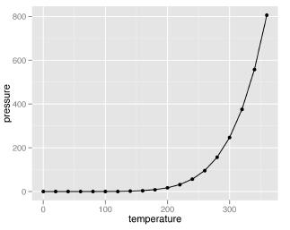
</div>


### 条形图  

```R
## 方法一
barplot(table(mtcars$cyl))

## 方法二
qplot(BOD$Time, BOD$demand, geom="bar", stat="identity")

## 方法三
ggplot(BOD, aes(x=Time, y=demand)) + geom_bar(stat="identity")
```

<div align="left">
  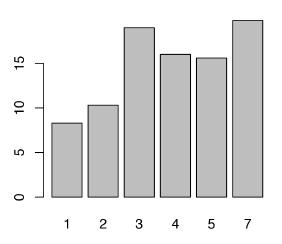
  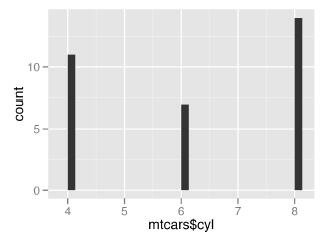
</div>


### 直方图  

```R
## 方法一
hist(mtcars$mpg)

## 方法二
qplot(mpg, data=mtcars, binwidth=4)

## 方法三
ggplot(mtcars, aes(x=mpg)) + geom_histogram(binwidth=4)
```

<div align="left">
  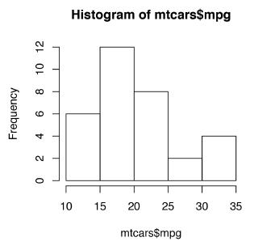
  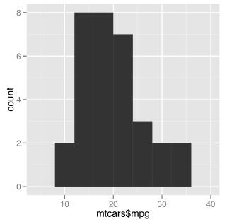
</div>


### 箱式图  

```R
## 方法一
boxplot(len ~ supp, data = ToothGrowth)

## 方法二
qplot(ToothGrowth$supp, ToothGrowth$len, geom="boxplot")

## 方法三
ggplot(ToothGrowth, aes(x=supp, y=len)) + geom_boxplot()
```

<div align="center">
  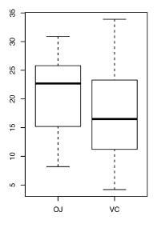
  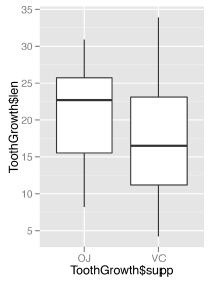
</div>


同时使用多个分组变量  

```R
## 方法一
boxplot(len ~ supp + dose, data = ToothGrowth)

## 方法二
qplot(interaction(supp, dose), len, data=ToothGrowth, geom="boxplot")

## 方法三
ggplot(ToothGrowth, aes(x=interaction(supp, dose), y=len)) + geom_boxplot()
```

<div align="center">
  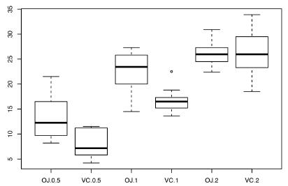
  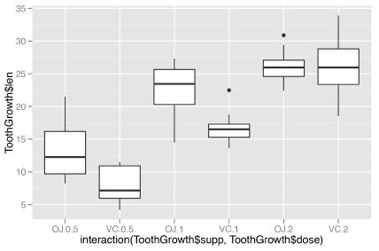
</div>


## 总结  

基于图层的`ggplot2`绘图风格是将图形中的每一个对象拆分开，然后根据不同的需求映射到图形中  

`ggplot()`函数控制图像的整体格式，x、y轴的对象  
`geom_point`函数描述的是点图层的属性  
`geom_line`函数描述的是线图层的属性  
`geom_bar`函数是条形图的属性  
`geom_boxplot`函数控制的是箱线图图层的属性  
`geom_histogram`函数控制直方图图层的属性  


## ggplot2图形语法  

必须的图表输入信息包括以下两部分：  

（1）ggplot()：底层绘图函数。DATA为数据集，主要是数据框（data.frame）格式的数据集；MAPPINGS变量的视觉通道映射，用来表示变量x和y，还可以用来控制颜色（color）、大小（size）或形状（shape）等视觉通道；STAT表示统计变换，与stat_×××()相对应，默认为"identity"（无数据变换）；POSITION表示绘图数据系列的位置调整，默认为"identity"（无位置调整）  

（2）geom_×××() | stat_×××()：几何图层或统计变换，比如常见的geom_point()（散点图）、geom_bar()（柱形图）、geom_histogram()（统计直方图）、geom_ boxplot()（箱形图）、geom_line()（折线图）等。我们通常使用geom_×××()函数就可以绘制大部分图表，有时候通过设定stat参数可以先实现统计变换。  

可选的图表输入信息包括如下5个部分，主要是实现图表的美化与变换等。  

(1) scale_×××()：度量调整，调整具体的度量，包括颜色（color）、大小（size）或形状（shape）等，跟MAPPINGS的映射变量相对应；  
(2) coord_×××()：坐标变换，默认笛卡儿坐标系，还包括极坐标系、地理空间坐标系等；  
(3) facet_×××()：分面系统，将某个变量进行分面变换，包括按行、列和网格等形式分面绘图，这部分内容具体可见第9章9.4节。  
(4) guides()：图例调整，主要包括连续型和离散型两种类型的图例。  
(5) theme()：主题设定，主要用于调整图表的细节，包括图表背景颜色、网格线的间隔与颜色等。  
