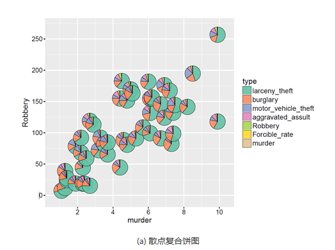
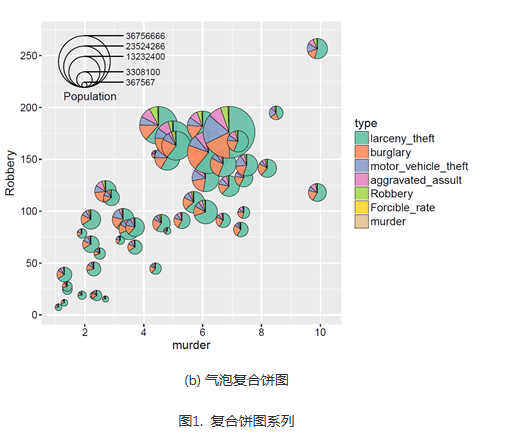
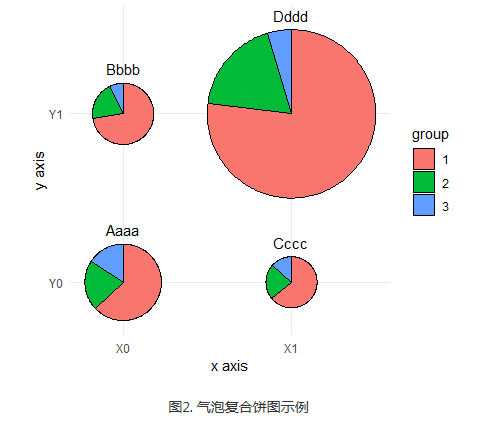

复合图形可以给出更多的信息，并且更能够观察数据之间的联系。一般所说的复合饼图包括以下两种：  

**散点复合饼图**（compound scatter and pie chart）可以展示三个数据变量的信息：(x, y, P)，其中x和y决定气泡在直角坐标系中的位置，P表示饼图的数据信息，决定饼图中各个类别的占比情况，如图1(a)所示。  

**气泡复合饼图**（compound bubble and pie chart）可以展示四个数据变量的信息：(x, y, z, P)，其中x和y决定气泡在直角坐标系中的位置，z决定气泡的大小，P表示饼图的数据信息，决定饼图中各个类别的占比情况，如图1(b)所示。  

<div align="center">
  
  
</div>


具体操作如下：  

```R
library(ggforce)
library(dplyr)
data_graph <- read.table(text = "x     y group    nb
1     0     0     1  1060
2     0     0     2   361
3     0     0     3   267
4     0     1     1   788
5     0     1     2   215
6     0     1     3    80
7     1     0     1   485
8     1     0     2   168
9     1     0     3   101
10     1     1     1  6306
11     1     1     2  1501
12     1     1     3   379", header = TRUE)

# make group a factor
data_graph$group <- factor(data_graph$group)

# add case variable that separates the four pies
data_graph <- cbind(data_graph, case = rep(c("Aaaa", "Bbbb", "Cccc", "Dddd"), each = 3))

# calculate the start and end angles for each pie
data_graph <- left_join(data_graph,
                        data_graph %>% 
                          group_by(case) %>%
                          summarize(nb_total = sum(nb))) %>%
  group_by(case) %>%
  mutate(nb_frac = 2*pi*cumsum(nb)/nb_total,
         start = lag(nb_frac, default = 0))

# position of the labels
data_labels <- data_graph %>% 
  group_by(case) %>%
  summarize(x = x[1], y = y[1], nb_total = nb_total[1])

# overall scaling for pie size
scale = .5/sqrt(max(data_graph$nb_total))

# draw the pies
ggplot(data_graph) + 
  geom_arc_bar(aes(x0 = x, y0 = y, r0 = 0, r = sqrt(nb_total)*scale,
                   start = start, end = nb_frac, fill = group)) +
  geom_text(data = data_labels,
            aes(label = case, x = x, y = y + scale*sqrt(nb_total) + .05),
            size =11/.pt, vjust = 0) +
  coord_fixed() +
  scale_x_continuous(breaks = c(0, 1), labels = c("X0", "X1"), name = "x axis") +
  scale_y_continuous(breaks = c(0, 1), labels = c("Y0", "Y1"), name = "y axis") +
  theme_minimal() +
  theme(panel.grid.minor = element_blank())
```

最终得到的图形如下所示：  

<div align="center">
  
</div>


